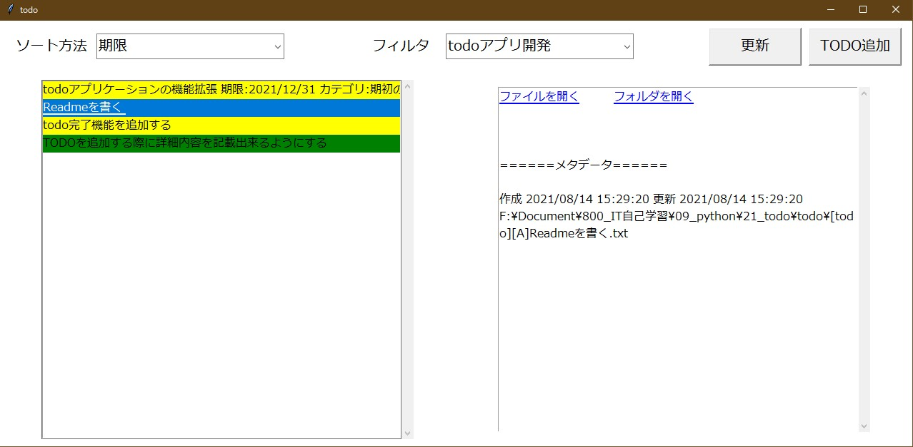

# Simple Todo

[日本語のREADME](./doc/README-JA.md)

## Overview

**Simple Todo** is todo application using text file.



## Usage

1. You register folder which **Simple Todo** search.
2. Put the string **[todo]** at the beginning of the file name in the folder.
3. If the file name contains the string **[todo]**, **Simple Todo** will display the 
file in the list screen.
   If the file is a text file, it will be displayed in the detail screen.
   
_The string you use does not have to be **[todo]**._  
_You can specify any string in the configuration file._

## Features

### Use text files for data storage

The use of text files has improved data reusability and portability.
Even if you don't use **Simple Todo** anymore, todo will remain.

### Simple

Compare other todo application, **Simple Todo** is very simple. 

* Add todo
* Display todo list
* Display todo detail
* Coloring by important
* Sort by limit or important
* Filtering by folder

## How to Start

### Configuration

Configuration file is **config.ini**.
Format is following.

TODO Japanese to English

```ini
[Dir_names]
#プルダウンに表示される名前=TODOファイルを格納しているフォルダの絶対パス
#例
#F:\Document\800_IT自己学習\09_python\51_QiitaというフォルダにTODOファイルを格納する場合
qiita=F:\Document\800_IT自己学習\09_python\51_Qiita

[File_names]
#TODOリスト一覧に表示したいファイル名。ワイルドカード(*)を使用できます。
#例

#先頭にtodoという文字列があるファイル
todo=todo*

#拡張子がpyのファイル
python=*.py

[Importance_color]
#重要度を表すためにファイル名で使用する文字列と対応する色
#defaultは重要度の文字列が入っていないファイルに対して使用される色です。
#色はredやblueなどの文字列で指定します。
default=white
A=red
B=yellow
C=green

[Meta_data]
#メタデータとして使用するファイル内の文字列の位置とメタデータのキー名
#TODOファイルのファイル名のうち[#metadata]のように、[]で囲まれた#で始まる文字をメタデータとして認識します。
# example: [#2020/09/01][#機能追加]example.txtとすれば期限:2020/09/01 カテゴリ:機能追加となります。
#          [#][#機能追加]example.txtとすればカテゴリ:機能追加となります（#しかないため期限は無視される）。
1=期限
2=カテゴリ
```


**config.ini**を編集する際の注意点になります。

- **Dir_names**には複数のフォルダ名を記載できます。
- **File_names**には複数のファイル名を記載できます。
- ファイル名を記載する場合はワイルドカード（*）を使用できます。
- ファイル名を複数記載した場合は**or**の検索になります。
- **Importance_color**で指定した色にする場合は、ファイル名に**[文字列]**を加えます（例：**A=red**とした場合は、**[A]hogehoge**というファイル名にする）。

**※1  記載したフォルダ名配下に大量のフォルダ、ファイルがある場合、検索するのに時間がかかる場合があります。**
 **極端な話ですがフォルダ名にC:\と記載すると、TODOリストを表示するまでにかなりの時間を要します。**

**※2  TODOファイルの文字コードはUTF-8にしてください。詳細画面が表示されません。**

### 実行方法

> python display.py

## 文書一覧

[Simple Todo で実現したいこと](./doc/SimpleTodoで実現したいこと.md)

