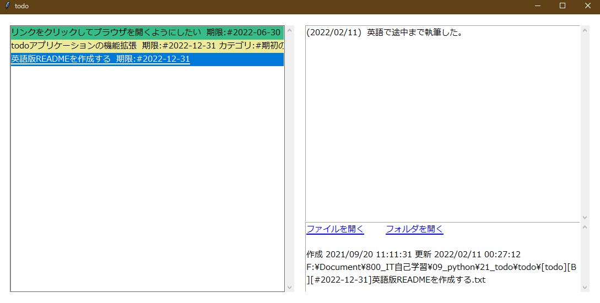

# Simple Todo

[日本語のREADME](./doc/README-JA.md)

## Overview

**Simple Todo** is todo application using text file.



## Usage

1. You register folder which **Simple Todo** search.
2. Put the string **[todo]** at the beginning of the file name in the folder.
3. If the file name contains the string **[todo]**, **Simple Todo** will display the 
file in the list screen.
   If the file is a text file, it will be displayed in the detail screen.
   
_The string you use does not have to be **[todo]**._  
_You can specify any string in the configuration file._

## Features

### Use text files for data storage

The use of text files has improved data reusability and portability.
Even if you don't use **Simple Todo** anymore, todo will remain.

### Simple

Compare other todo application, **Simple Todo** is very simple. 

* Add todo
* Display todo list
* Display todo detail
* Coloring by important
* Sort by limit or important
* Filtering by folder

## How to Start

### Configuration

Configuration file is **config.ini**.
Format is following.

TODO Japanese to English

```ini
[Dir_names]
# name=path
# "name" is displayed name in select folder which right click.
# example
# F:\Document\example
example=F:\Document\example

[File_names]
# String which this application search for display file to list screen.
# Can use wildcard (*).

# example
# Head "todo"
todo=todo*

# python file
python=*.py

[Importance_color]
# "A" adn "B", "C" express importance.
# A > B > C
# These string contain file name.
# [todo][A]example.txt
#
# "default" will use when not specified string.
#
# Color specify string such as white or red, yellow or HEX.
default=white
A=red
B=#edea99
C=#37bc87

[Meta_data]
# Metadata index and key.
# [todo][A][#metadata1][#metadata2]example.txt
# You set metadata such as [#metadata].
# example: [#2020/09/01][#Add Function]example.txt -> limit:2020/09/01 category:Add Function
#          [#][#Add Function]example.txt -> category:Add Function
limit=limit
category=category
```

**config.ini**を編集する際の注意点になります。

- **Dir_names**には複数のフォルダ名を記載できます。
- **File_names**には複数のファイル名を記載できます。
- ファイル名を記載する場合はワイルドカード（*）を使用できます。
- ファイル名を複数記載した場合は**or**の検索になります。
- **Importance_color**で指定した色にする場合は、ファイル名に **[文字列]** を加えます（例： **A=red** とした場合は、 **[A]hogehoge** というファイル名にする）。

**※1  記載したフォルダ名配下に大量のフォルダ、ファイルがある場合、検索するのに時間がかかる場合があります。**
 **極端な話ですがフォルダ名にC:\と記載すると、TODOリストを表示するまでにかなりの時間を要します。**

**※2  TODOファイルの文字コードはUTF-8にしてください。詳細画面が表示されません。**

### How to Run

> python display.py

## Document

[Simple Todo で実現したいこと](./doc/SimpleTodoで実現したいこと.md)

